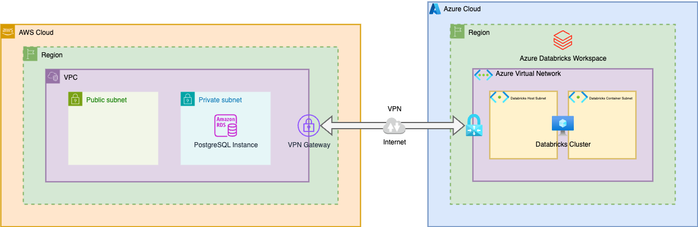

# Cross-Cloud

## Introduction

This Terraform stack deploys a multi-cloud infrastructure spanning AWS and Azure, featuring VPCs, VPN tunnels, and an Azure Databricks workspace. Its provides a foundation for building and evaluating different cross-cloud scenarios.

## Architecture 

The stack sets up a Site-to-Site VPN in active-active mode with BGP between AWS and Azure.



## 🏗️ **Architecture Overview**

This stack creates a **hybrid cloud environment** with the following components:

### **AWS Infrastructure**
- **VPCs** with DNS support and hostnames enabled
- **Subnets** across multiple availability zones
- **Internet Gateways** for public internet access
- **Route Tables** with custom routing rules
- **Virtual Private Gateways** for VPN connectivity
- **Customer Gateways** for on-premises/cross-cloud connectivity
- **VPN Connections** with redundant tunnels
- **Security Groups** with customizable rules
- **RDS PostgreSQL instances** for database workloads

### **Azure Infrastructure**
- **Resource Groups** for logical organization
- **Virtual Networks** with custom address spaces
- **Subnets** with route table and NSG associations
- **Network Security Groups** with custom rules
- **Public IPs** for gateway resources
- **Virtual Network Gateways** for VPN connectivity
- **Local Network Gateways** representing remote sites
- **VPN Connections** with dual tunnels for redundancy
- **Private DNS Zones** for internal name resolution
- **Private Endpoints** for secure service access
- **Databricks Workspaces** with private networking

### **Cross-Cloud Connectivity**
- **Site-to-Site VPN** tunnels between AWS and Azure
- **Redundant connections** for high availability
- **BGP routing** for dynamic route propagation
- **Private connectivity** for secure data transfer

## 📁 **Stack Structure**

```
examples/cross-cloud/
├── main.tf                    # Main resource definitions
├── variables.tf               # Input variables
├── locals.tf                  # Local values and data transformations
├── providers.tf               # Provider configurations
├── outputs.tf                 # Output values
├── terraform.auto.tfvars      # Variable values
└── README.md                  # This documentation
```

## 🚀 **Getting Started**

### **Prerequisites**

1. **Terraform** >= 1.0 installed
2. **AWS CLI** configured with appropriate credentials
3. **Azure CLI** configured with appropriate credentials
4. **Subscription access** to both AWS and Azure with necessary permissions

### **Required Permissions**

**AWS:**
- EC2 full access (VPCs, subnets, gateways, security groups)
- RDS management permissions
- Route53 (if using DNS features)

**Azure:**
- Resource Group management
- Virtual Network management
- Databricks workspace creation
- Private DNS zone management

### **Configuration**

1. **Clone the repository** and navigate to this directory:
   ```bash
   cd examples/cross-cloud/
   ```

2. **Review and customize** `terraform.auto.tfvars`:
   ```hcl
   environment = "dev"        # or "staging", "prod"
   region      = "us-east-1"  # AWS region
   location    = "eastus"     # Azure region
   
   tags = {
     Owner     = "your.email@company.com"
     ManagedBy = "Terraform"
     Project   = "CrossCloudInfra"
   }
   ```

3. **Configure YAML files** in `../../configs/cross-cloud/`:
   - Adjust CIDR blocks, names, and other parameters
   - Ensure no IP address conflicts between AWS and Azure
   - Review VPN settings and BGP ASN numbers

## 🔧 **Deployment**

### **Step 1: Initialize Terraform**
```bash
terraform init
```

### **Step 2: Plan the Deployment**
```bash
terraform plan
```
Review the plan carefully, especially:
- Network CIDR blocks for conflicts
- VPN gateway configurations
- Resource naming conventions

### **Step 3: Deploy Infrastructure**
```bash
terraform apply
```

**⚠️ Note:** Initial deployment typically takes 30+ minutes due to VPN gateway provisioning time.

### **Step 4: Verify Connectivity**
After deployment, verify:
- VPN tunnel status in both AWS and Azure consoles
- Route propagation in route tables
- Connectivity between cloud networks

## 📋 **Configuration Files**

This stack uses YAML configuration files located in `../../configs/cross-cloud/` for easy customization:

### **AWS Configs**
- `aws/vpcs.yaml` - VPC definitions
- `aws/subnets.yaml` - Subnet configurations
- `aws/virtual-private-gateways.yaml` - VPN gateway settings
- `aws/customer-gateways.yaml` - Customer gateway definitions
- `aws/virtual-private-gateway-connections.yaml` - VPN connections
- `aws/security-groups.yaml` - Security group rules
- `aws/rds-postgresql-instances.yaml` - Database configurations

### **Azure Configs**
- `azure/resource-groups.yaml` - Resource group definitions
- `azure/virtual-networks.yaml` - VNet configurations
- `azure/virtual-network-gateways.yaml` - VPN gateway settings
- `azure/local-network-gateways.yaml` - Local network gateways
- `azure/virtual-network-gateway-connections-tunnel-*.yaml` - VPN connections
- `azure/databricks-workspaces.yaml` - Databricks workspace settings
- `azure/private-dns-zones.yaml` - Private DNS configurations

## 🔒 **Security Considerations**

- **Network Segmentation:** Subnets are isolated with proper security groups/NSGs
- **VPN Encryption:** All cross-cloud traffic is encrypted via IPsec
- **Private Endpoints:** Azure services use private connectivity
- **Access Control:** Security groups implement least-privilege access
- **DNS Security:** Private DNS zones prevent data leakage

## 💰 **Cost Optimization Tips**

1. **VPN Gateways:** These are the most expensive components
2. **Instance Sizing:** Review RDS and Databricks compute sizes (This example uses a sandbox instance)
3. **Data Transfer:** Monitor cross-cloud data transfer costs
4. **Environment Cleanup:** Use `terraform destroy` for development environments
5. **Resource Scheduling:** Consider auto-shutdown for non-production resources

## 🔄 **Maintenance**

### **Regular Tasks**
- Monitor VPN tunnel health
- Review security group rules
- Update Terraform modules
- Check for provider updates
- Backup terraform state

### **Updates**
- Test changes in development environment first
- Use `terraform plan` before applying changes
- Monitor costs after infrastructure changes

## 📊 **Monitoring & Logging**

Consider implementing:
- **CloudWatch** (AWS) and **Azure Monitor** for metrics
- **VPN connection monitoring** for tunnel status
- **Network flow logs** for traffic analysis
- **Cost monitoring** for budget tracking

## 🤝 **Contributing**

When making changes to this stack:
1. Test in development environment first
2. Update relevant YAML configuration files
3. Update this README if adding new components
4. Follow the established naming conventions
5. Ensure proper tagging for all resources

## 📚 **Additional Resources**

- [AWS VPN Documentation](https://docs.aws.amazon.com/vpn/)
- [Azure VPN Gateway Documentation](https://docs.microsoft.com/en-us/azure/vpn-gateway/)
- [Azure Databricks Documentation](https://learn.microsoft.com/en-us/azure/databricks/)
- [Terraform AWS Provider](https://registry.terraform.io/providers/hashicorp/aws/)
- [Terraform AzureRM Provider](https://registry.terraform.io/providers/hashicorp/azurerm/)
- [AWS Repost](https://repost.aws/knowledge-center/vpn-azure-aws-bgp)
- [AWS Blog: Private Network Connectivity](https://aws.amazon.com/blogs/modernizing-with-aws/designing-private-network-connectivity-aws-azure/)
- [AWS Blog: Building secure multicloud access](https://aws.amazon.com/blogs/networking-and-content-delivery/building-secure-multicloud-access-with-aws-client-vpn-and-aws-site-to-site-vpn/)
- [Microsoft Blog](https://techcommunity.microsoft.com/blog/startupsatmicrosoftblog/dynamic-multi-cloud-networking-configuring-a-bgp-enabled-vpn-between-azure-and-a/4281443)
- [AWS Tutorial](https://repost.aws/knowledge-center/vpn-azure-aws-bgp)
- [Microsoft Tutorial](https://learn.microsoft.com/en-us/azure/vpn-gateway/vpn-gateway-howto-aws-bgp)

---

**Note:** This infrastructure creates billable resources in both AWS and Azure. Always review costs and clean up unused resources to avoid unexpected charges.


